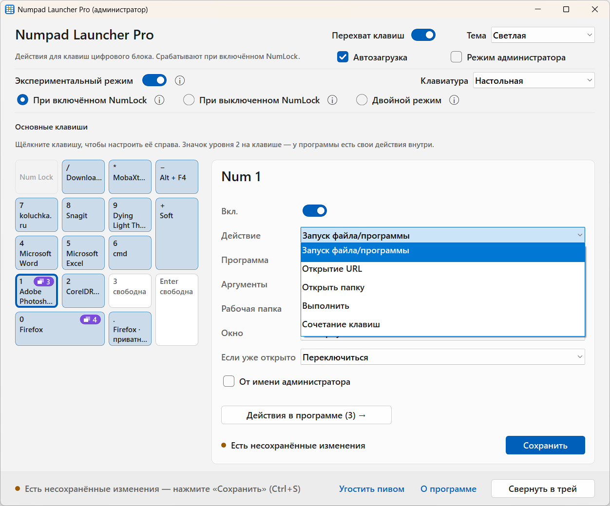
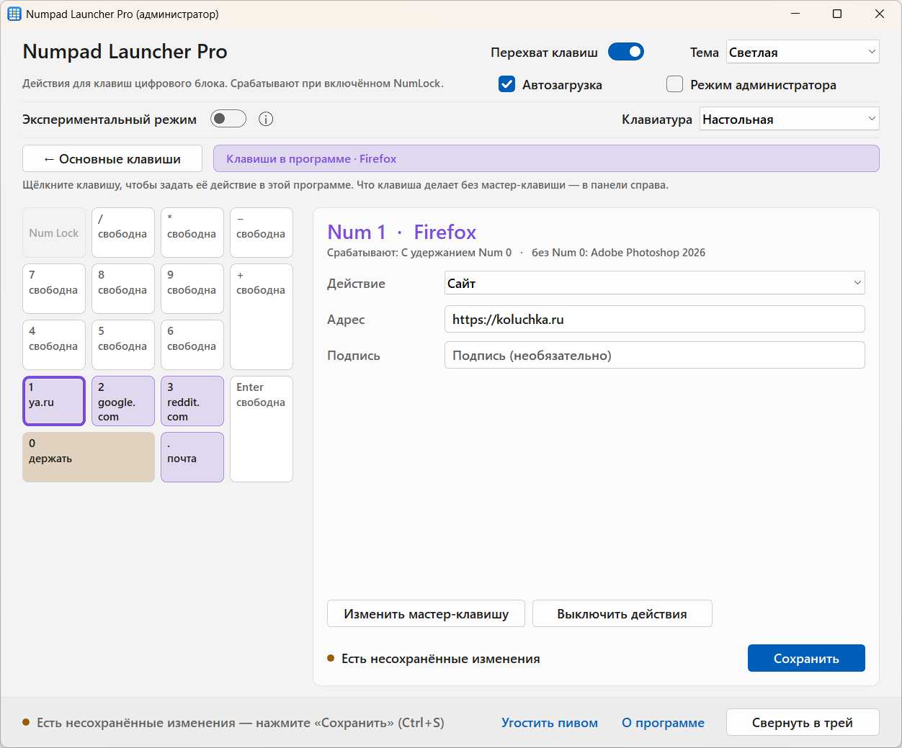
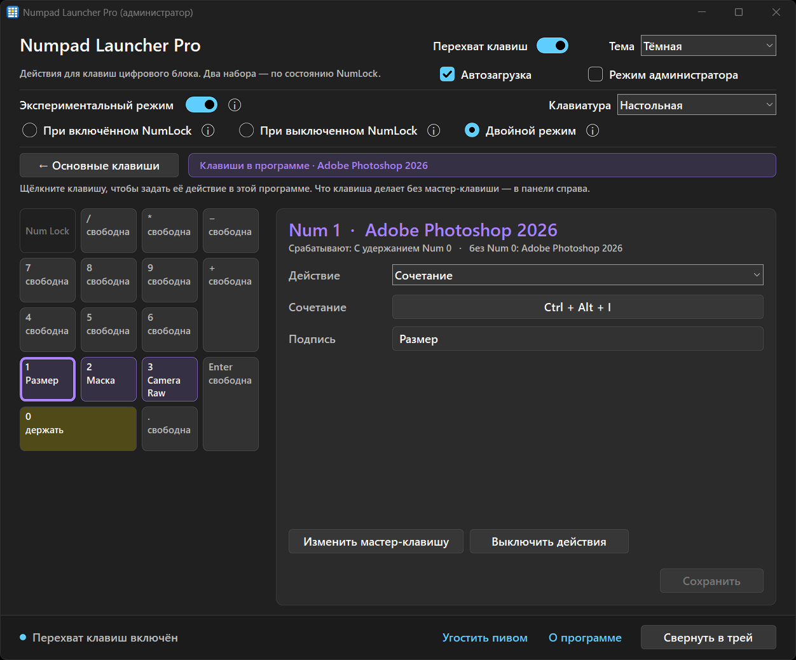
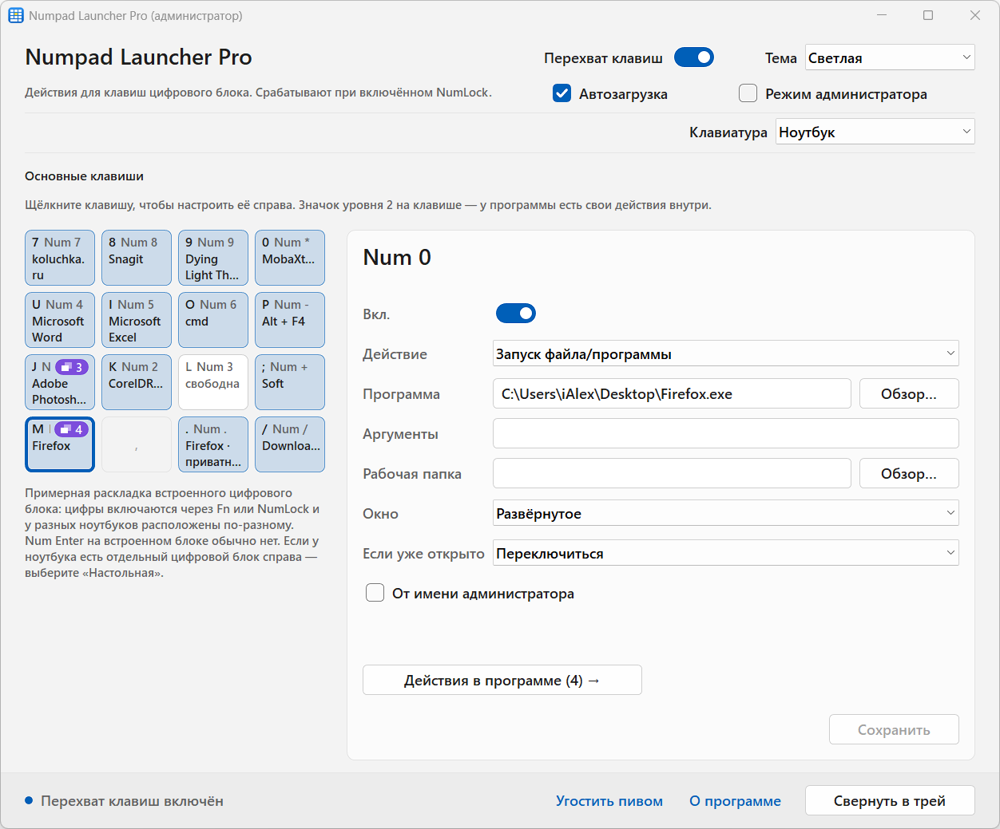

# Numpad Launcher Pro

**Turn your numeric keypad into a quick-launch panel for Windows**

Programs, websites, folders, commands and keyboard shortcuts — one key each.
And inside Photoshop, your browser or Excel, the same keys can do something else.

[**Download**](../../releases/latest) · [Changelog](CHANGELOG.md) · [Русский](README.md) · [koluchka.ru](https://koluchka.ru)

Screenshots show the Russian interface; the English interface is chosen during installation.

## Why

Most keyboards have a numeric keypad that hardly ever gets used. Numpad Launcher Pro turns it into 16 hotkeys:

- **Num 1** — open Photoshop, or switch to it if it is already open;
- **Num 2** — open your mail in the browser;
- **Num /** — open Downloads or a network share such as `\\192.168.1.230\Documents`;
- **Num Enter** — show the desktop (Win + D).

While Photoshop is active, **Ctrl + Num 1** presses `Ctrl + Shift + Alt + M` for you. In the browser, **Num 0 + Num 1** opens a site in a new tab. Every program gets its own set.

## Features

**Five action types**
- **Program or file** — with arguments, start-in folder, window state (normal, maximized, minimized) and "run as administrator". If already open: open another, switch to it, switch or minimize, cycle windows.
- **Website** — in the default or a chosen browser; new tab, new window or private window.
- **Folder** — including network shares; if it is already open in Explorer, its window is brought forward.
- **Command** — like Run (Win + R), optionally with a hidden console.
- **Keyboard shortcut** — sent to the active window, repeated up to 10 times.

**Two key levels**
- **Main keys** work everywhere.
- **Keys in program** work only in that program's window: a shortcut, a website in the same browser, or a file in the same program. They trigger while holding a master key (Num 0, Ctrl, Alt or Shift) — so keys behave normally without it — or without holding.

**Convenience**
- A visual keypad map shows what each key does and which keys are free.
- "Desktop" or "Laptop" keyboard — for laptops with an embedded keypad (Fn or NumLock).
- **Experimental mode**: interception with NumLock off, or dual mode — two sets of 16 keys switched with the NumLock key.
- The tray icon color shows the working mode.
- Check for updates on demand — in the About window and the tray menu.
- Launched programs come to the foreground.
- Firefox private windows can be set up separately from normal ones.
- Light and dark themes, crisp on any display scaling.
- Russian and English — chosen during installation.

**Lightweight**
- A single ~600 KB `.exe`, no .NET, Java or other runtimes.
- About 100 KB of memory and 0% CPU in the tray. The settings window exists only while open.
- With no keys assigned or interception turned off, the keyboard is not monitored at all.

## Screenshots

| Keys in program | Dark theme | Laptop |
|---|---|---|
|  |  |  |

## Installation

1. Download `NumpadLauncher-Setup-x.y.z.exe` from [Releases](../../releases/latest).
2. Run it and choose the language.
3. Install "for all users" (recommended, required for administrator mode) or "just for me".
4. The settings window opens after installation. Afterwards the program lives in the tray — click its icon to open the settings.

**Requirements:** Windows 10 (1607 or later) or Windows 11, 64-bit. Windows 7/8 and 32-bit systems are not supported.

## Usage

1. Click a key on the map — its settings appear on the right.
2. Turn it on, choose an action and set the program, website, folder, command or record a shortcut.
3. Click **Save** (Ctrl + S).
4. For a key with a program, click **Actions in program…**, choose how they trigger and set up the level-2 keys.

Keys work while **NumLock is on**. Combinations with Ctrl, Alt, Shift and Win are not intercepted (except the chosen master key), so Alt codes and Shift + arrows keep working.

## Experimental mode

The "Experimental mode" switch in the Settings header opens three options (each with an (i) hint):

- **When NumLock is on** — normal work.
- **When NumLock is off** — the other way round: actions run with NumLock off, and with NumLock on the keypad types digits.
- **Dual mode** — two sets of main keys, "NumLock on" and "NumLock off", up to 32 actions. The NumLock key switches the sets; choose the set to edit above the key map. In-app shortcuts are shared by both sets.

The separate arrow keys are not affected, and only keypad keys that have an action are taken. Some keyboards (wireless, via KVM switches) can't tell the keypad from the arrow keys with NumLock off — the mode may work incorrectly with them. Not available with the "Laptop" keyboard.

**Tray icon:** green — normal mode (interception with NumLock on), blue — with NumLock off, dark red — dual mode, grey — interception is off.

## Administrator mode

Windows does not deliver simulated keystrokes to windows running as administrator. Turn on "Administrator mode" in the settings or the tray menu — Windows asks once, and from then on the program starts through Task Scheduler without prompts. Programs you launch with keys still start with normal rights.

Available only when installed "for all users" (in Program Files).

## FAQ

**Keys do nothing.** Check the "Key interception" switch (a grey tray icon means it is off) and NumLock: it must be on in normal mode and off in "When NumLock is off" mode. While the settings window is active, digits are typed as usual — by design.

**A shortcut doesn't reach the program.** The program is probably running as administrator. Turn on administrator mode.

**How do I pause everything?** Right-click the tray icon and uncheck "Key interception".

**How do I find out about a new version?** About → "Check for updates", or right-click the tray icon → "Check for updates". The program never goes online by itself — only via this button.

**Where are the settings?** In `%AppData%\NumpadLauncher\config.json`. You can copy it to another computer.

**Something doesn't work right.** Turn on "Debug log" in the tray menu, repeat the action and attach `%AppData%\NumpadLauncher\debug.log` to a [bug report](../../issues/new/choose).

## License

Numpad Launcher Pro is **free for personal, non-commercial use**. Use within companies, by sole proprietors or for profit requires a paid license — contact the author via [koluchka.ru](https://koluchka.ru).

You may redistribute it free of charge and unmodified only; selling is prohibited. Modifying the program or its source code without the author's written consent is prohibited. Full text: [LICENSE.md](LICENSE.md).

If you find the program useful, you can [buy the author a beer](https://pay.cloudtips.ru/p/d91dc610) 🍺

---

© 2026 Predteche · [koluchka.ru](https://koluchka.ru)

